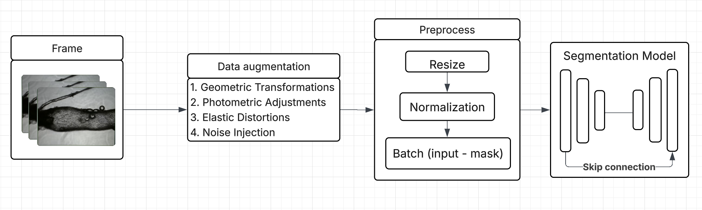
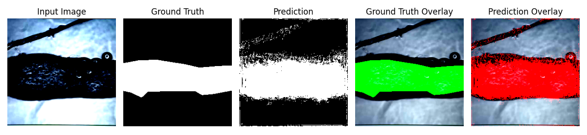
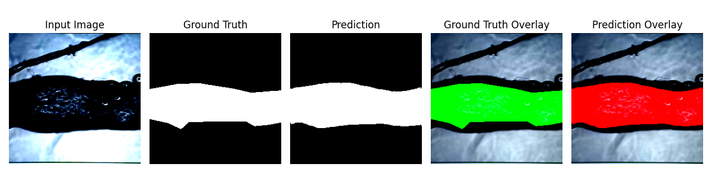
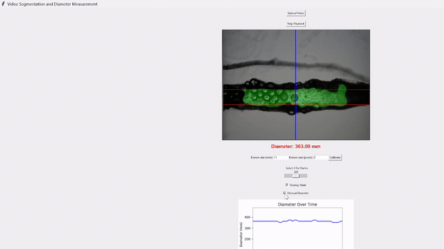

# Lymphatic Vessel Segmentation

Segment lymphatic vessels from microscopy **video** and measure their diameter
over time. The pipeline extracts frames, trains a U-Net / U-Net++ model with
heavy data augmentation, and ships a PyQt5 app that runs inference and tracks
vessel diameter live. It supports an ongoing study on functional ryanodine
receptors in rat mesenteric collecting lymphatic vessels.



## Why this matters

The lymphatic system is sometimes called the "forgotten circulation". It keeps
fluid balanced, drives immune response, and is involved in cancer metastasis.
Vessel **diameter** is a telling parameter: changes in it point to conditions
like lymphedema, lymphangiectasia, and tumor-induced obstruction. The catch is
that these vessels are hard to image and hard to measure by hand.

## What's new here

Most prior segmentation work targets static images; we work from video, with
only a handful of recordings available:

- **Few-sample video pipeline** — train on two recordings, validate on a third
  vessel section the model has never seen.
- **Augmentation for boundaries** — heavy augmentation pushes the model off
  background noise and onto vessel edges, which is what makes diameter
  measurement reliable (see results).
- **End-to-end app** — load a video, get per-frame masks, diameter, and volume.

## Method

### Preprocessing

Frames start at $640 \times 480 \times 3$. We resize the longest edge to 256
(aspect ratio preserved), take a random $256 \times 256$ crop, then normalize
each channel with ImageNet statistics so a pretrained backbone behaves:

$$x_{\text{norm}} = \frac{x - \mu}{\sigma}, \quad \mu = (0.485, 0.456, 0.406), \quad \sigma = (0.229, 0.224, 0.225)$$

### Augmentation

Each sample passes through a randomized stack: geometric transforms (rotation to
180°, flips, scale/pad/crop), photometric shifts (brightness, contrast), elastic
and perspective distortions, and Gaussian / salt-and-pepper noise. Every image
becomes a unique variation while its mask stays valid.

### Architecture

The model is a U-Net (and a nested U-Net++) with a **ResNet-34** encoder
pretrained on ImageNet. The encoder halves spatial resolution and grows channels
$64 \to 512$ across four residual stages; the decoder upsamples and fuses encoder
features through skip connections:

$$\mathbf{F}_i = \mathcal{C}_i\!\left(\text{Up}(\mathbf{F}_{i+1}) \oplus \mathbf{E}_i\right)$$

where $\oplus$ is channel-wise concatenation and $\mathcal{C}_i$ is a two-layer
conv block. A $3\times3$ segmentation head produces a single logit map. For
binary masks we apply a sigmoid and threshold at 0.5:

$$\hat{\mathbf{Y}} = \sigma(\mathbf{O}) = \frac{1}{1 + e^{-\mathbf{O}}}, \qquad
\hat{\mathbf{Y}}_{\text{bin}} = \mathbb{1}\!\left[\hat{\mathbf{Y}} > 0.5\right]$$

### Training

Batch size 4, 10 epochs, Adam at $1\times10^{-4}$, optimized with
`BCEWithLogitsLoss`:

$$\mathcal{L}_{\text{BCE}} = -\big[y \log \sigma(x) + (1 - y)\log(1 - \sigma(x))\big]$$

We report four metrics — IoU and Dice for region overlap, Pixel Accuracy, and a
**Boundary F1** that scores only edge pixels (the one that matters most for
diameter).

## Results

Augmentation barely moves region metrics but transforms boundary quality, which
is the whole point for diameter measurement:

| Model            | IoU        | Dice       | Pixel Acc  | Boundary F1 |
|------------------|------------|------------|------------|-------------|
| U-Net (no aug)   | 0.6957     | 0.8195     | 0.8856     | 0.0024      |
| U-Net (with aug) | **0.8654** | **0.9267** | **0.9605** | **0.5476**  |

Boundary F1 jumps from 0.0024 to 0.5476. The statistic — without
augmentation the model prone to noise outside the vessel; with it they are centralized intp the ground truth.

**Without augmentation** — noisy, out-of-bounds masks:



**With augmentation** — masks align with the ground truth:



Among architectures on the augmented set, U-Net++ gives the best balance (IoU 0.8748, Dice 0.9312) while PSPNet leads on Boundary F1 (0.8472). The app ships with U-Net++ trained with BoundaryLoss.

## Demo

The app overlays the predicted mask and plots diameter as the vessel pulses:



## Install and run

```bash
pip install -r requirements.txt
python App.py
```

This launches the PyQt5 GUI. Open a video, pick a model, and read off diameter
and volume per frame. In `online` mode the app pulls weights from the Hugging
Face Hub; pretrained `.pth` files are also included in this repo.

## Files

- `App.py` — PyQt5 desktop app (segmentation + diameter measurement)
- `models.py` — model definitions, losses (Boundary/Dice/Combined), training
- `preprocess.py` — frame extraction and the augmentation pipeline
- `requirements.txt` — dependencies · `docs/` — README figures
